# NotedIQ — Smart Study & Meeting Intelligence Layer

NotedIQ (DualSpace) is a premium, dual-mode web application designed to turn raw notes, text, documents, files, and audio/video recordings into structured intelligence. It offers two specialized workspaces customized for different workflows:
- 🎓 **Student Mode (Study Guide)**: Focused on parsing lectures, generating definitions, study guides, and visual flowcharts for base-case checks and academic notes.
- 💼 **Corporate Mode (Meeting Minutes)**: Tailored for meetings, capturing key discussion points, highlights, task checklists, and action items.

---

## 📸 Application Showcase

### 1. Landing & Authentication Pages
- **Landing Page Hero Header**:
  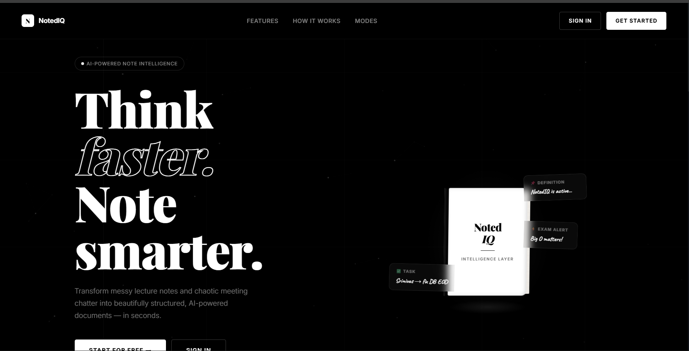
- **Feature Highlights ("Built for two worlds")**:
  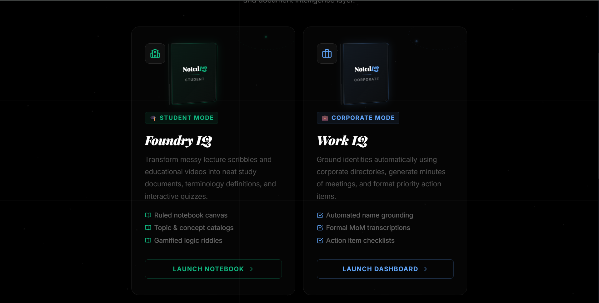
- **Process Steps ("Three steps. Zero friction.")**:
  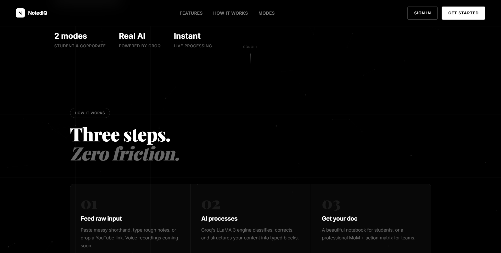
- **Sign In Screen**:
  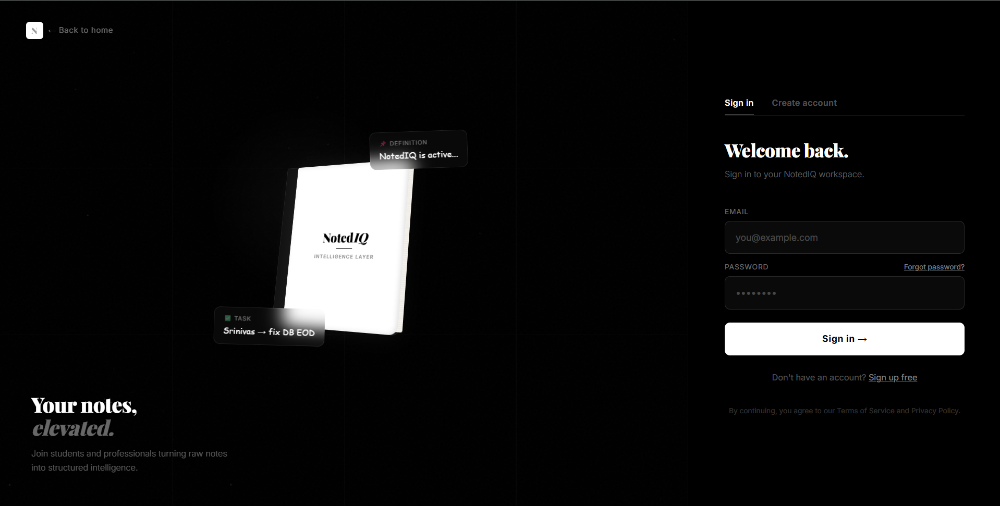
- **Sign Up / Account Creation**:
  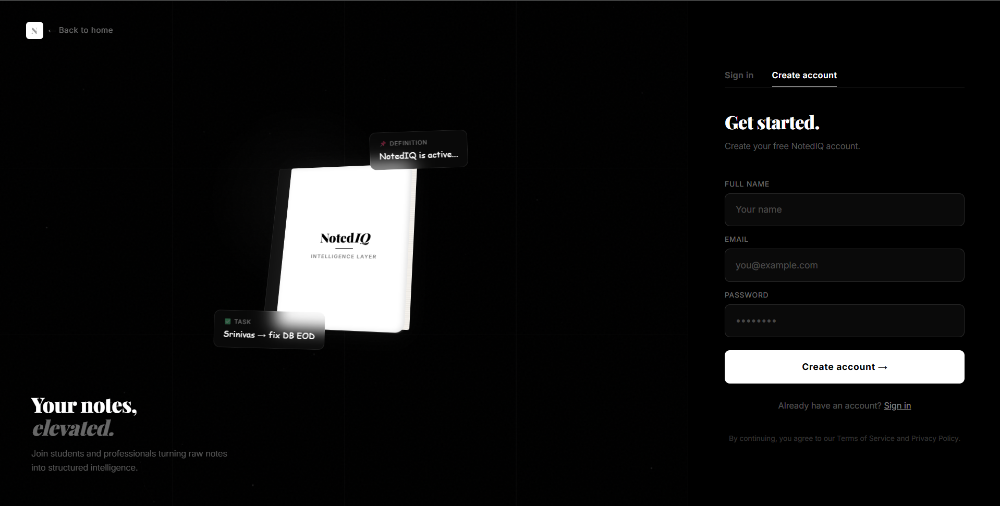

### 2. Dashboard & Navigation
- **Workspace Selection / Main Page**:
  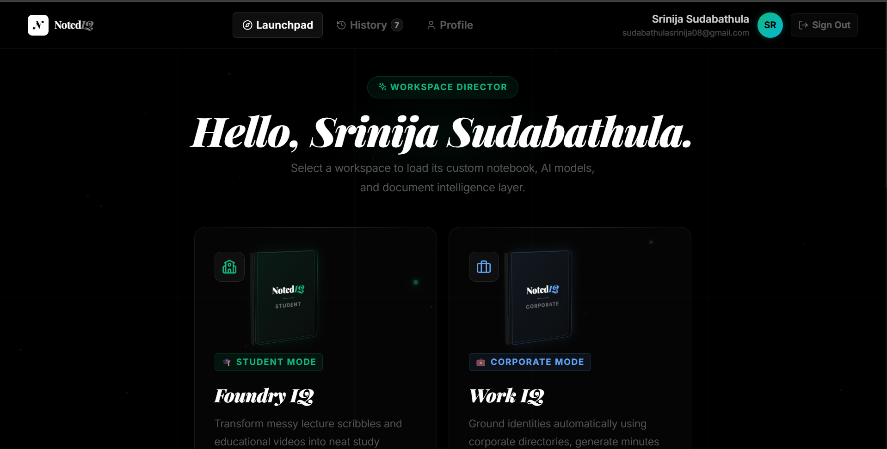
- **Modes Launcher Details**:
  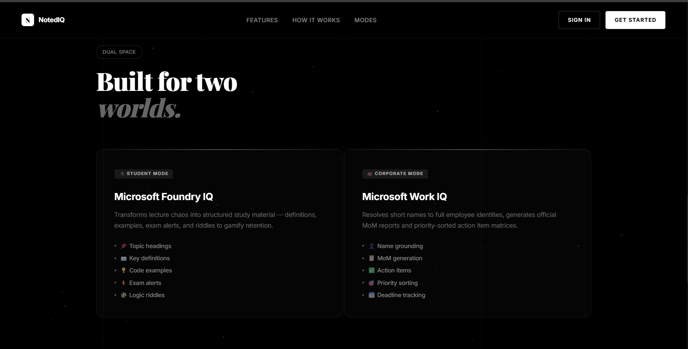
- **User Profile Dashboard**:
  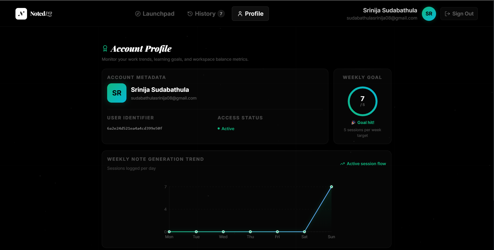

### 3. Study & Workspaces
- **Notebook Welcome Card**:
  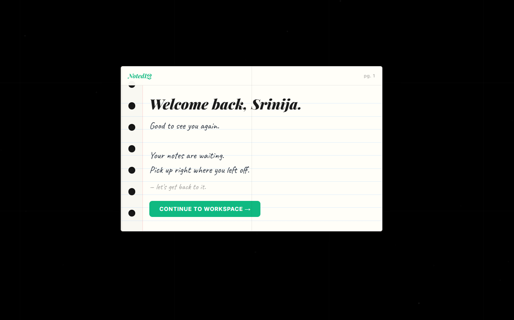
- **🎓 Student Study Workspace**:
  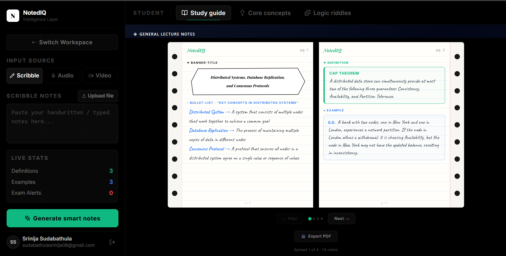
- **💼 Corporate Summary Workspace**:
  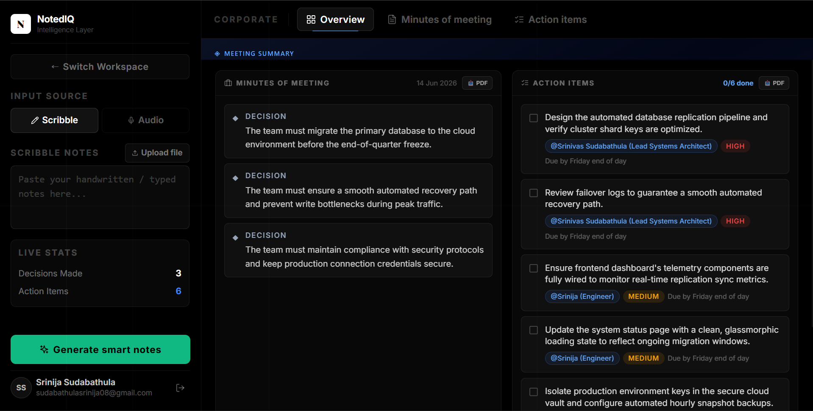

### 4. Activity & Session History
- **History Dashboard Overview**:
  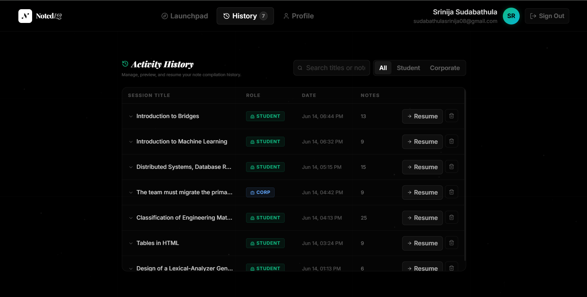
- **Active Session Preview**:
  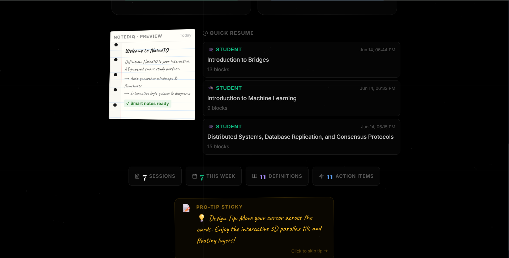

---

## 🎥 Walkthrough Video

### Core Workflow Walkthrough
Demonstration of the general note workspace layout, live processing engine status updates, and visual note blocks rendering.

[](https://drive.google.com/file/d/19NmuP378RDczLWWIzvLs3rMCbWL6pbt6/view?usp=sharing)

> 🎥 **[Click here to watch the full 5-minute Walkthrough Video on Google Drive](https://drive.google.com/file/d/19NmuP378RDczLWWIzvLs3rMCbWL6pbt6/view?usp=sharing)**
> *(Or click the preview image above to view)*

---

## 🛠️ Tech Stack
- **Frontend**: React (Vite + TypeScript), CSS, TailwindCSS (for container grids), Lucide Icons, Socket.io-client.
- **Backend**: Node.js, Express, Socket.io, Mongoose (MongoDB).
- **AI Integrations**: Groq SDK (Whisper-large-v3 for audio transcription, Llama-3/Mixtral models for smart text restructuring).
- **Communication & Delivery**: Nodemail SMTP (Gmail App Passwords) for password recovery OTP delivery.

---

## 🚀 Setup & Installation

### Prerequisites
- Node.js (v18 or higher)
- MongoDB installed locally and running on default port `27017`

### Environment Configurations
Create a `.env` file in the `server` folder with the following variables:
```env
PORT=5000
MONGO_URI=mongodb://localhost:27017/dualspace
JWT_SECRET=your_jwt_secret_key
GROQ_API_KEY=your_groq_api_key
SMTP_USER=your_gmail_address
SMTP_PASS=your_gmail_app_password
```

### Installation Steps

1. **Clone the repository**:
   ```bash
   git clone <repository_url>
   cd DualSpace
   ```

2. **Setup Server**:
   ```bash
   cd server
   npm install
   node server.js # Starts backend on http://localhost:5000
   ```

3. **Setup Client**:
   ```bash
   cd ../client
   npm install
   npm run dev # Starts frontend on http://localhost:3000
   ```
